# OneTJ 同济教务第三方客户端（安卓App）

## 姊妹项目：OneTJ Web APP（适用于电脑浏览器、iOS、鸿蒙等设备）

请见：[onetj-webapp](https://github.com/FlowerBlackG/onetj-webapp)

部署版本直达：

- 信息办部署（仅限校园网）：[onetj-webapp-tjnic](http://nic.pages.tongji.edu.cn/nic-tool/onetj-webapp)
- GitHub Pages部署：[onetj-webapp-github-pages](https://flowerblackg.github.io/onetj-webapp)

## 功能一览

注：预览图仅为展示效果，数据为虚构。

### 主页

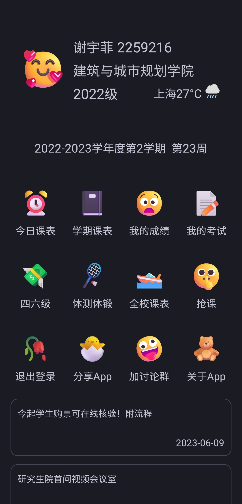

从同济 API 读取学生基本信息，并在首页展示。男生和女生呈现的头像图不同。

当日气温较高或较低时，会呈现“彩蛋”图。

主页提供 app 各功能的入口。下方展示一系统首页通知，用户可以点进去查看详情。

### 登录页

| 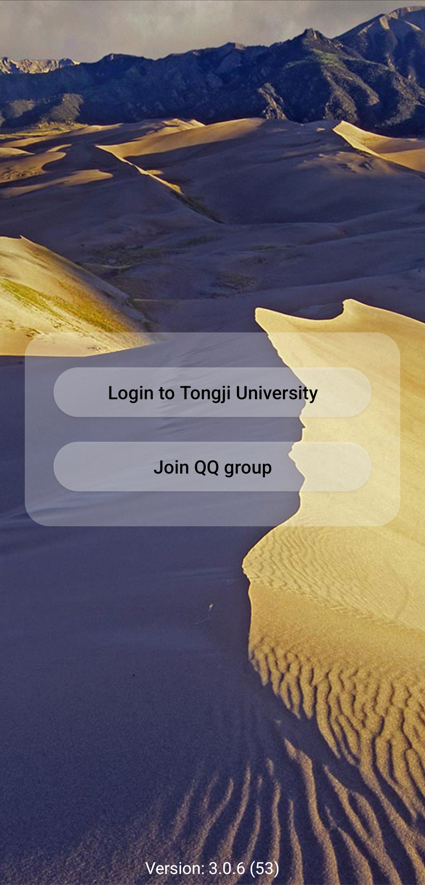 | 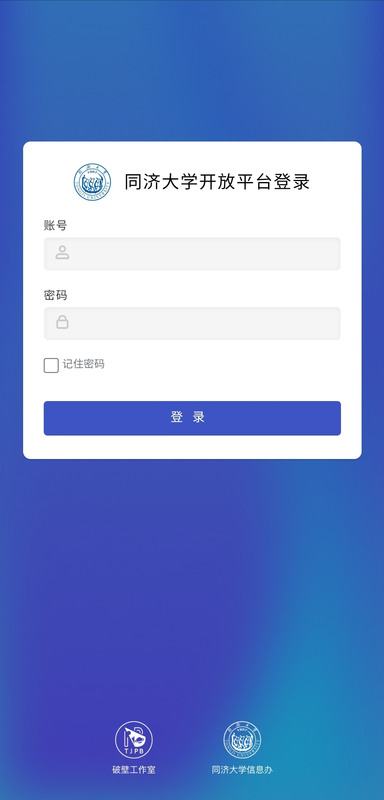 |
| ---------------------------------------------------- | ----------------------------------------------------- |

将用户引向信息办的统一登录网站。

### 抢课

要求补充完成一次登录，以绕过信息办接口，直接访问一系统接口。

提供多线程抢课能力，支持在抢课过程中动态加入想要抢的其他课程。支持后台运行（会主动向用户申请权限）。

注：该功能暂时关闭。

### 课程成绩

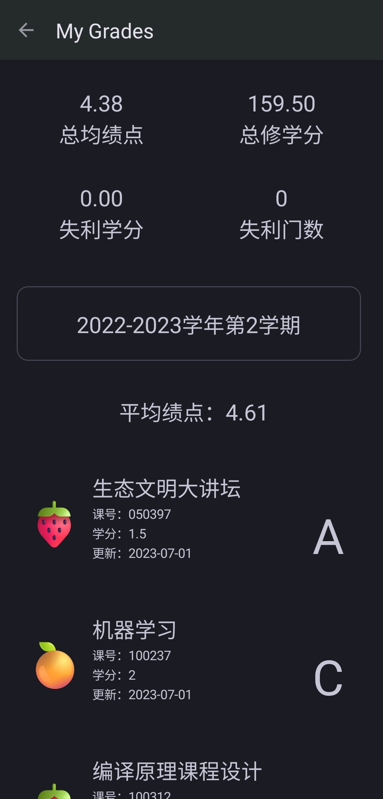

呈现该学生所有学期的成绩。

### 今日课表

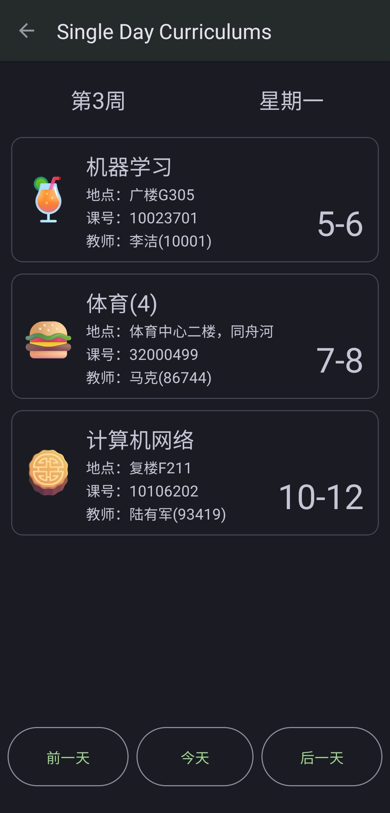

显示单日课表。可以切换日期。

### 体锻体测

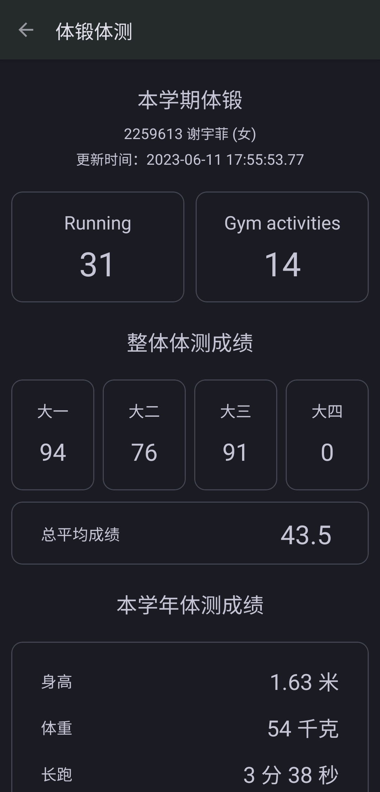

查看体测体锻数据。

### 四六级

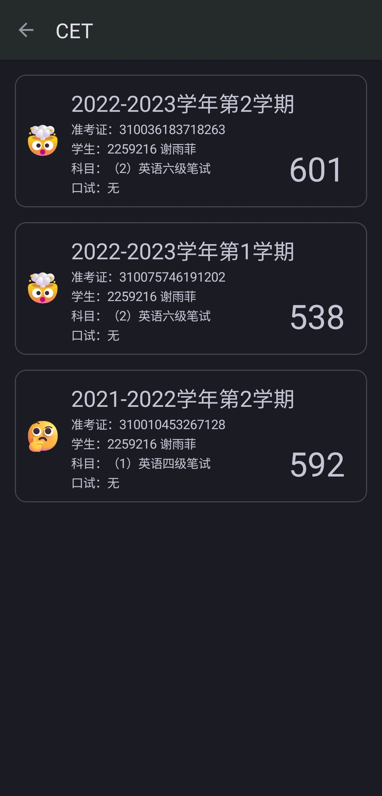

查看四六级考试成绩。

### 全部课表

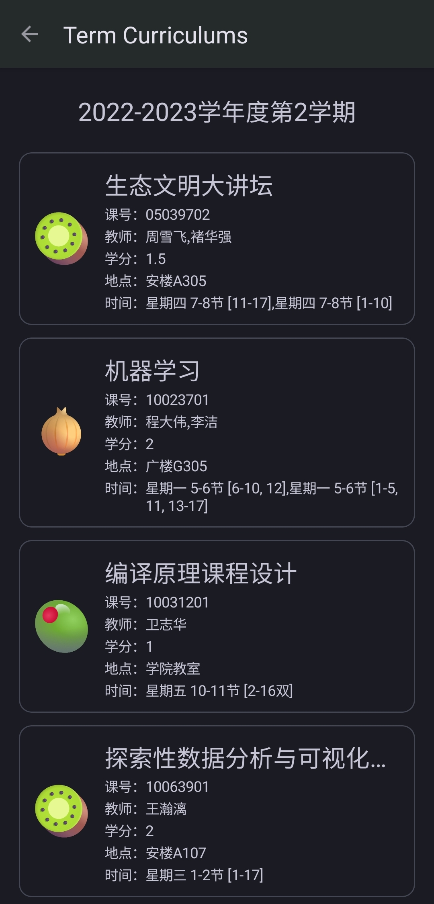

查看该学生本学期全部课程。

### 一系统首页通知

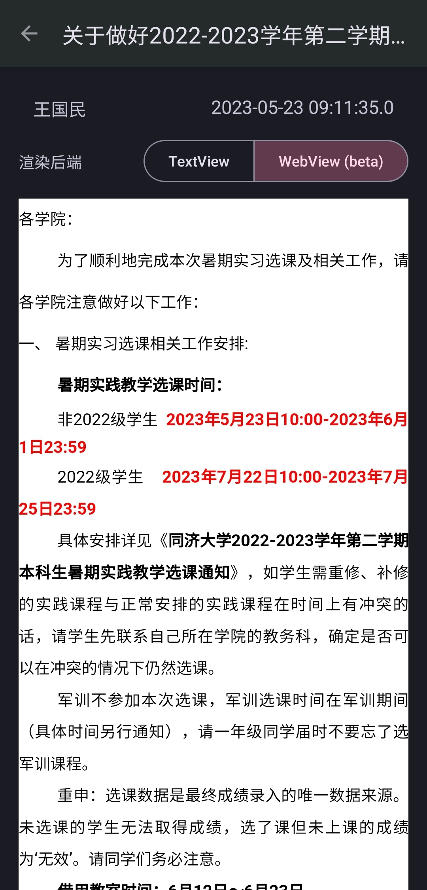

查看一系统首页通知详情。

### 全校课表

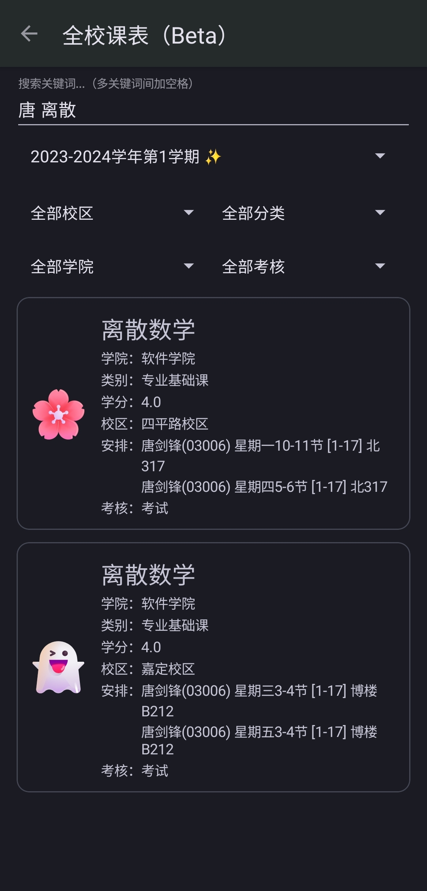

查询全校课表。支持丰富的筛选搜索。

### 其他

* app 自动更新
* 登录日志采集

## 分发说明

**允许任何人将经过官方签名的 apk 安装包分享到任意平台。**

经过官方签名的 apk 可以从以下渠道获取：

* FlowerBlackG/OneDotTongji GitHub 仓库的 Release 栏目
* app 内自动更新模块检测到更新时，提供的下载地址

## app 开发信息

* 平台：Android 10+
* 语言：Kotlin
* 构建系统：Gradle (Kotlin DSL)
* 开源许可：木兰宽松许可证第2版

## 推荐开发环境

* IDE: Android Studio
* 调试设备：Android 12+

## 项目整体结构

common 存放其他 app 也可共享的组件。

onetongji 存放本 app 的子模块。

## 共享组件

### InfoCard

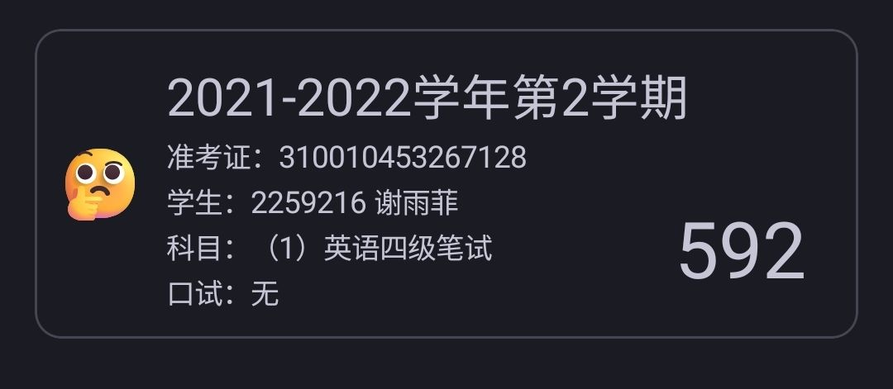

你可以注意到，不少功能内都有长相相似的信息卡片。

该卡片由以下部分组成：

* 标题
* 信息区域
* 左侧图标
* 右下角文本

其中，信息区域由多个 Key Value 对组成，之间以一个**分隔符**隔开。

InfoCard 拥有很强的定制能力。可定制部分包括但不限于：

* 是否有边框
* 信息区域分隔符是什么
* 是否有图标
* 字体大小
* 内部各方向间距。

## OneTJ

### service

后台服务。自动抢课的**抢课**部分需要在后台运行。

### activity

用户直接看得见的界面。其中，func 里面存放各个子功能的界面。

所有界面继承自 OneTJActivityBase，这样我们可以在 Base 里面做一些通用工作。通过调整构造函数的传入参数，我们可以自定义一个 activity 有无标题栏，有无返回按钮，有无进度条等。

### tools

一些开发工具。对接同济 API 以及开发者自有后端的工具都在这里面。

## 参与开发

克隆代码，用最新版 Android Studio 打开。

建议关闭 GarCloudApi.kt 内的日志上报功能。开发过程会产生大量无意义日志，它们会干扰对云端日志的分析。

开发完毕，向主仓库 FlowerBlackG/OneDotTongji 提交 pr 即可。

由衷期待并感谢你的参与！

## 其他

本项目由个人开发者维护。如果该项目对你有帮助，希望能为本 app 提供宣传。

此外，欢迎体验开发者的另一个项目，一款自动刷锻 app。地址：[跑吗](https://github.com/FlowerBlackG/FakeRun)

## Star History

